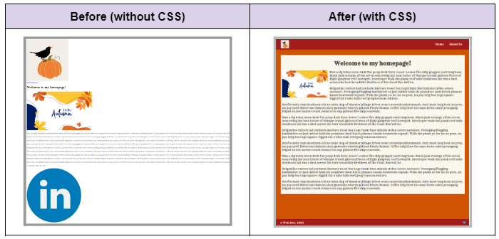

# Kata Kickstarts - CSS (September 26, 2023)
​
This is a small Vue project scaled-down from the capstone starter code. The back-end has been removed so we can focus on styling on the front-end.


<sub>( This GIF is in jest... I actually ❤️ CSS! )</sub>

<br><br>



<br><br>

This document walks you through how to set up and run the project, as well as providing a handful of katas to work on in the code.
​
## Project setup
​
(1) The first thing you'll need to do is to download any dependencies by running this command:
​
```
npm install
```

(2) Start your Vue application with the following command:
​
```
npm run serve
```

(3) Click on the localhost link that appears to open the application in a browser.

<br>
<hr>
<br>

## Icebreakers

<br>

### Kata #1: Create a custom color palette

Our website needs a solid brand. Part of that brand will be our own [custom color scheme](https://www.canva.com/colors/color-palettes/). Create a custom style sheet in /public/styles.css. In this file, define variables for each color in your palette so you can reference them by name in any component that imports the style sheet. Then, use the vars to declare the background color and global default text color in App.vue.

📝 Note: Remember that the `scoped` attribute is used to keep styles local to a given component.

🎨These are the colors and custom var names I'm using: #A11B1B ("candy-apple"), #FAF7ED  ("black-cat"), #D05301  ("jack-o-lantern"), and #483D3C  ("ghost").

<br>

### Kata #2: Designate a custom site font

To further brand our website, we need to choose a snazzy font. To do this, we'll grab one from [Google Fonts](https://fonts.google.com/) and import it into our centralized CSS.

🎨The font I chose is called [Rye](https://fonts.google.com/specimen/Rye?query=rye).

<br>

### Kata #3: Touch up the main content area

We really need our content to "pop" on the site pages. Style the content area on the homepage to make sure it stands out.
- A well-contrasted background color and some padding (in and around) might help.
- While you're there, center the image and the header.


<br>
<hr>
<br>

## Breakout rooms

<br>

### Kata #4: Style the header

Wait… What header??

📝 Note: This header might be easier to wrangle if you utilize Flexbox or Grid… 

📝 Note: You may have to adjust styles in more than one file.

- Assign the header a background color from your global variables so it's easier to see.
- Make it so that the header is the full width of the screen.
- Adjust the height of the header.
- Resize the site logo so it stays in the header.
- Center the header content vertically.
    - Put the logo image on the far left of the header.
    - Put the navigation on the far right.
- For good measure, throw some padding in there too to make everything line up with the main content.

<br>

### Kata #5: Style the nav links

The site links have left a bit to be desired. Let's style them.
Change the font color to contrast well with your header (if it doesn't already).
- Add some space around the links so they're not smooshed together.
- Remove the underline from the links when they're inactive.
- When someone hovers over the link, readd the underline.

<br>

### Kata #6: Tackle the footer: Part 1

Now that our header is looking great, it's time to make some adjustments to the footer. 

Note: The relationship of the footer to the main content may be wonky (or maybe not?) but if so, we'll fix that later. Just focus on styling the footer for now.

📝 Note: Hmmm… This might be a job for… Oh, Idk… Flexbox or Grid?

- Give the footer a background color with a high contrast, then adjust the font color so it's visible.
- Resize the content so that it fits inside the footer.
- Center the content vertically inside the footer.
    - Put the copyright notice to the far left of the footer.
    - Put the LinkedIn logo on the far right.
- Add some padding to make it match the site header and main content spacing.

<br>

### Kata #7: Style the picture so text flows around it

Our content is looking pretty good, but we can jazz it up with text that flows around the image on the homepage. Write some CSS rules to make the image float (hint hint) to the left side of the text content. You may need some spacing around the image to make it look nicer.

<br>

### Kata #8: Add a media query

Our flow-around text and image look great on desktop now, but once we hit smaller devices, this could get dicey. Add a media query that removes the flow-around text when we hit a certain screen size (use the Chrome DevTools device emulator to determine what breakpoint to set.)

<br>
<hr>
<br>

## Challenge

### Kata #10: Tackle the footer: Part 2

Ok, so there's *a chance* that our page content is way out of control. If it is, let's use styling to bring it back into line so it'll play nice with our footer.

… You probably know what I'm going to say now… This is probably a job for (🥁drum roll) Flexbox or Grid!

<br>
<hr>
<br>

## Resources
- [BootcampOS](https://lms.techelevator.com/) units
    - Intro to HTML and CSS
    - CSS selectors and box model
    - CSS Grid
    - CSS Flexbox
- TE Supplemental Resources
    - [CSS Flexbox quick reference](https://docs.google.com/document/d/1jXKdS4TA3uc59e9NlU1_STE36HruwAah2xAUTDSuSO4/edit?usp=drive_link)
    - [CSS Grid quick reference](https://docs.google.com/document/d/18WatnKZ4kk-LywAiAZhEMppB2TjIsx15sBgtBeP4zm8/edit?usp=drive_link)
- Guides and documentation
    - [Basic concepts of Flexbox](https://developer.mozilla.org/en-US/docs/Web/CSS/CSS_flexible_box_layout/Basic_concepts_of_flexbox) (MDN Web Docs)
    - [A Complete Guide to Flexbox](https://css-tricks.com/snippets/css/a-guide-to-flexbox/) (CSS Tricks)
    - [CSS grid layout](https://developer.mozilla.org/en-US/docs/Web/CSS/CSS_grid_layout) (MDN Web Docs)
    - [A Complete Guide to CSS Grid](https://css-tricks.com/snippets/css/complete-guide-grid/) (CSS Tricks)
- Other
    - [Flexbox Froggy](https://flexboxfroggy.com/) (game)
    - [Grid Garden](https://codepip.com/games/grid-garden/) (game)
    - [CSSReference.io](https://cssreference.io/flexbox/) (website)
    - [Grid Generator](https://cssgrid-generator.netlify.app/) (widget)
    - [CSS Grid Beginner's Guide](https://www.codeinwp.com/blog/css-grid-tutorial-layout) (tutorial)